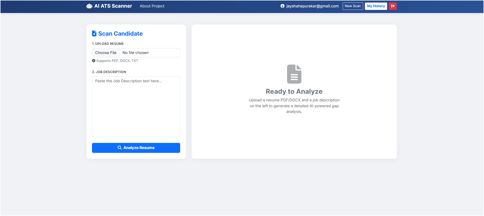
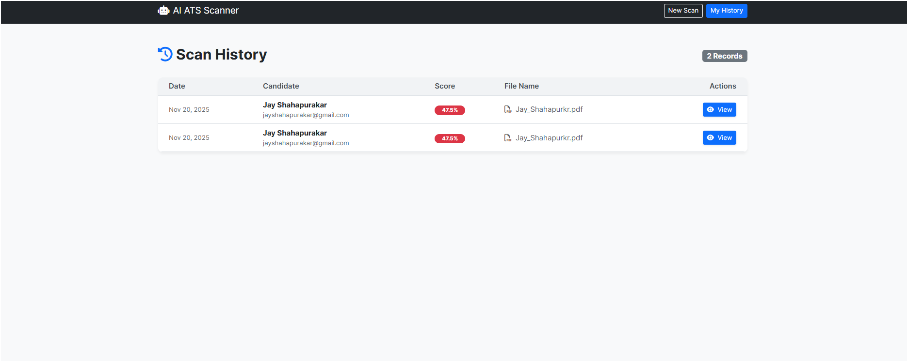

# 🚀 AI-Powered ATS Resume Scanner


A full-stack **Applicant Tracking System (ATS)** that uses **Deep Learning (SBERT)** to semantically analyze resumes against job descriptions. Unlike traditional keyword matchers, this system understands the *context* of skills, provides a weighted match score, identifies missing skills, and generates professional PDF reports.

---

## 📸 Application Preview

| **Modern Dashboard** | **Detailed Analysis** |
|:---:|:---:|
|  |  |
| *Secure User Dashboard* | *Semantic Scoring & Gaps* |

| **Scan History** | **PDF Reporting** |
|:---:|:---:|
|  |  |
| *Database Persistence* | *Downloadable Reports* |

---

## 🌟 Key Features

### 🧠 Intelligent AI Engine
* **Semantic Matching:** Uses **`sentence-transformers` (all-MiniLM-L6-v2)** to calculate cosine similarity between resume skills and job requirements.
* **Smart Parsing:** Extracts Name, Email, Phone, and Skills from **PDF, DOCX, and TXT** files using **spaCy NER** and Regex.
* **Weighted Scoring:** Generates a 0-100% ATS Score based on both keyword coverage and semantic relevance.

### 💻 Full-Stack Web Application
* **User Authentication:** Secure Login/Signup system so users can access their private data.
* **Persistent Database:** Saves all scan history, scores, and matched skills using **SQLite** (Django ORM).
* **Job Recommendations:** Suggests alternative roles from an internal database based on the candidate's extracted skill set.

### 📊 Reporting & UX
* **Gap Analysis:** Automatically highlights **Missing Skills** in red and **Matched Skills** in green.
* **PDF Export:** Generates professional, downloadable PDF reports for recruiters using `xhtml2pdf`.
* **Responsive UI:** Modern, mobile-friendly interface built with **Bootstrap 5** and custom CSS.

---

## 🛠️ Tech Stack

* **Backend Framework:** Django 5.0
* **Language:** Python 3.10
* **AI & NLP:**
    * `spaCy` (Natural Language Processing)
    * `sentence-transformers` (Deep Learning Embeddings)
    * `scikit-learn` (Cosine Similarity)
* **File Processing:** `pdfplumber` (PDF), `python-docx` (DOCX)
* **Frontend:** HTML5, CSS3, Bootstrap 5, FontAwesome
* **Database:** SQLite (Development)
* **Testing:** Django `TestCase`

---

## 📂 Project Architecture

```text
ats_web/
├── data/                  # Data Store
│   ├── skill_taxonomy.csv # Database of 800+ technical skills
│   └── sample_jds/        # Text-based Job Descriptions for matching
├── scanner/               # Main Django App
│   ├── templates/scanner/ # HTML Templates (Login, Dashboard, Reports)
│   ├── extractor.py       # File parsing logic (PDF/DOCX)
│   ├── parser.py          # Regex & NER extraction logic
│   ├── semantic_matcher.py# SBERT Model & similarity calculation
│   ├── scorer.py          # Weighted Scoring Algorithm
│   ├── recommender.py     # Job Role Recommendation Engine
│   ├── models.py          # Database Schema (ScanHistory)
│   └── views.py           # Controller Logic
├── manage.py              # Django CLI Tool
└── db.sqlite3             # Database file
